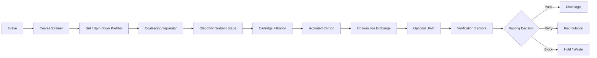

# Architecture

## Design intent

IX-Liquid is a **modular pilot remediation skid**. It assumes the field liquid is messy, the operator may have limited time, sensors can fail, and expensive polishing media should not be sacrificed to avoidable front-end loading.

## Functional chain

Physical zones
Z-1 Intake and foul-protection zone
intake guard
basket strainer
grit knockdown
flushing access
early restriction detection
Z-2 Separation zone
coalescing separator
oil capture hardware
waste tote
overfill sensing
first containment points
Z-3 Polishing zone
dual cartridge housings
activated carbon vessel
optional ion-exchange vessel
optional UV-C reactor
sample taps before and after polishing
Z-4 Clean routing zone
final quality sensors
hold/recirculation tote
discharge valve
recirculation valve
blocked-discharge logic
Z-5 Controls and evidence zone
PLC
HMI
battery-backed controls power
event logger
comms
local alarm tower
maintenance lockout and service controls
Control philosophy

IX-Liquid only starts the treatment path when the startup permissives are healthy. It does not rely on a single on/off command.

Core logic:

no treatment start if the waste tote is full
no discharge if quality thresholds are bad or data is stale
no continued run if a critical sensor fails without a safe fallback
no hidden alarms; operator should always be able to see why the unit is blocked
separate controlled stop, process isolate, containment event, and major safety event
Nominal operating states
BOOT
READY
RUNNING
WATCH
DEGRADED
MAINTENANCE
ESD_0
ESD_1
ESD_2
ESD_3
Mission packs

This repo keeps the core skid generic. Site-specific media can be swapped by mission pack.

Examples:

oily runoff pack
marina sheen response pack
suspended solids / sediment pack
dissolved contaminant polishing pack
microbial control pack

Each mission pack must define:

target feed envelope
expected pressure loss
service interval trigger
waste handling needs
required sample plan
non-claims
